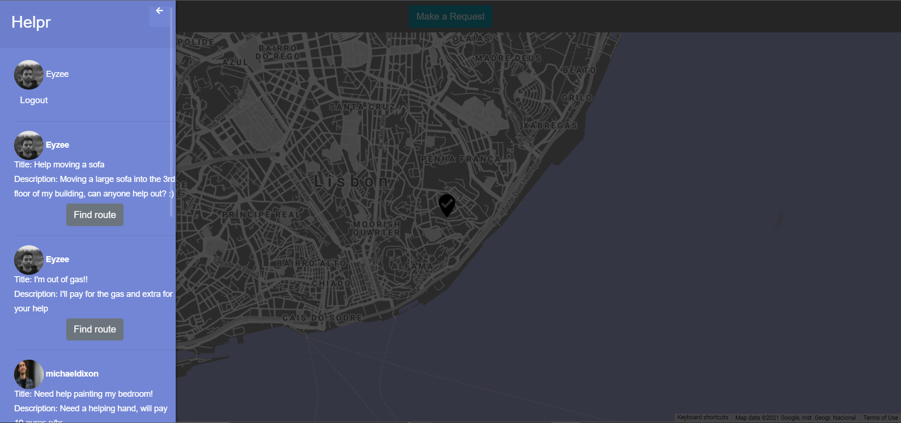

# project-helpr

"A Co-Helping Platform"

 

## Description

Helpr is an Express NodeJs web application that allows users to both make and repsond to public help requests all while being connected via geo location API's.

### Built With

* [Node.js](https://nodejs.org/)
* [ExpressJS](https://expressjs.com/)
* [handlebarsJS](https://handlebarsjs.com/)
* [MongoDB](https://www.mongodb.com/)
* [Mongoose](https://mongoosejs.com/)
* [Axios](https://www.npmjs.com/package/axios)
* [Cloudinary](https://cloudinary.com/)
* [bcryptjs](https://www.npmjs.com/package/bcryptjs)
* [GoogleMapsAPI](https://developers.google.com/maps/documentation/javascript/overview)
* [DirectionsAPI](https://developers.google.com/maps/documentation/directions/overview)
* [GeoLocationAPI](https://developers.google.com/maps/documentation/geolocation/overview)

(<a href="#top">back to top</a>)

### Live Demo

A live demo of the Helpr web app can be found in the following link:
 
<a href="https://app-helpr.herokuapp.com/"> Helprr </a>

## Functionalities

Helpr allows it's users to:

* Allows users to create an account
* Encrypts the user password when creating an account
* Basic authentication
* Create a help request that has their current location
* Help requests can contain a title and a description
* User's details is stored on a MongoDB database
* Help requests can be viewed by other users on the navbar 
* User can help each other, and when they do so the API's calculate the nearest route between

## Contact

João Prates - joaoprates.az@gmail.com

linkedin - <a href="https://www.linkedin.com/in/joao-prates-az/"> João Prates </a>

GitHub: [https://github.com/JayPrates/](https://github.com/JayPrates/)

(<a href="#top">back to top</a>)

(<a href="#top">back to top</a>)

